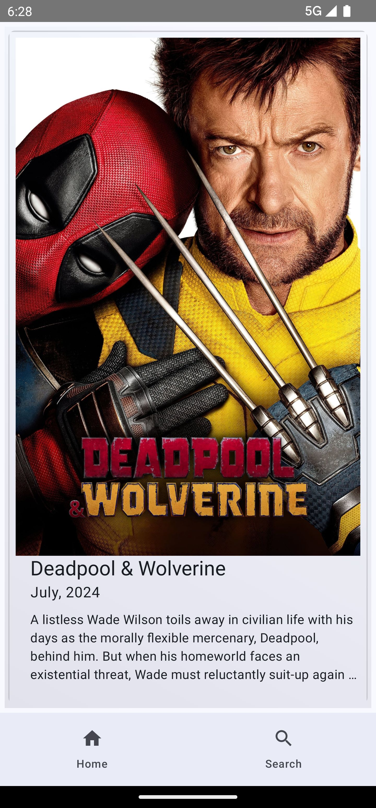

# **TheMovieDatabase**

An Android app to browse through unlimited movies.

## **👇 Download** ##

Click [here](https://github.com/PrasoonDhaneshwar/TheMovieDatabaseJetpackCompose/releases/download/2.0/TheMovieDatabase-v2.0.apk) to download **TheMovieDatabase** application

---

## 📸 Screenshots ##

  
  
  
  
  
  
  
  

---

### **🔑 The Movie Database (TMDB) API** ###

*API:*
<https://api.themoviedb.org/>

---

# 🛠️Libraries and Dependencies #

- *[Ktor](https://ktor.io/)* - Create asynchronous client and server applications. Anything from microservices to multiplatform HTTP client apps in a simple way.
- *[Coil](https://coil-kt.github.io/coil/).* An image loading library for Android and Compose Multiplatform.
- *[Hilt](https://dagger.dev/hilt/)* - Provides a standard way to incorporate Dagger dependency injection into an Android application.
- *[Paging](https://developer.android.com/jetpack/androidx/releases/paging)* - Easy to load data gradually and gracefully within an app's List.
- *[Material Components for Android](https://github.com/material-components/material-components-android)* - Modular and customizable Material Design UI components for Android.
